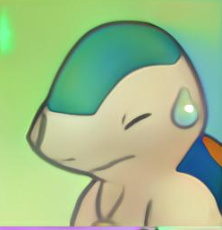
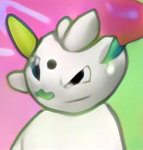

# PokeGAN - Exploration of generating novel Pokemon using Deep Convolutional Generative Adversarial Networks

# Dataset
A total of 4881 Pokemon mugshots were sourced from [Kaggle Pokemon Mugshots](https://www.kaggle.com/brilja/pokemon-mugshots-from-super-mystery-dungeon) dataset. 
Original images from dataset measure 64x64 and have too small of a resolution. To address this, images from dataset were upscaled to 512x512 using [waifu2x-chainer](https://github.com/tsurumeso/waifu2x-chainer).

# Results

2 Novel pokemon generated from network.

# Training
Trained on Google Colab Pro on StyleGan2-ada using Tesla V100s for multiple days.
